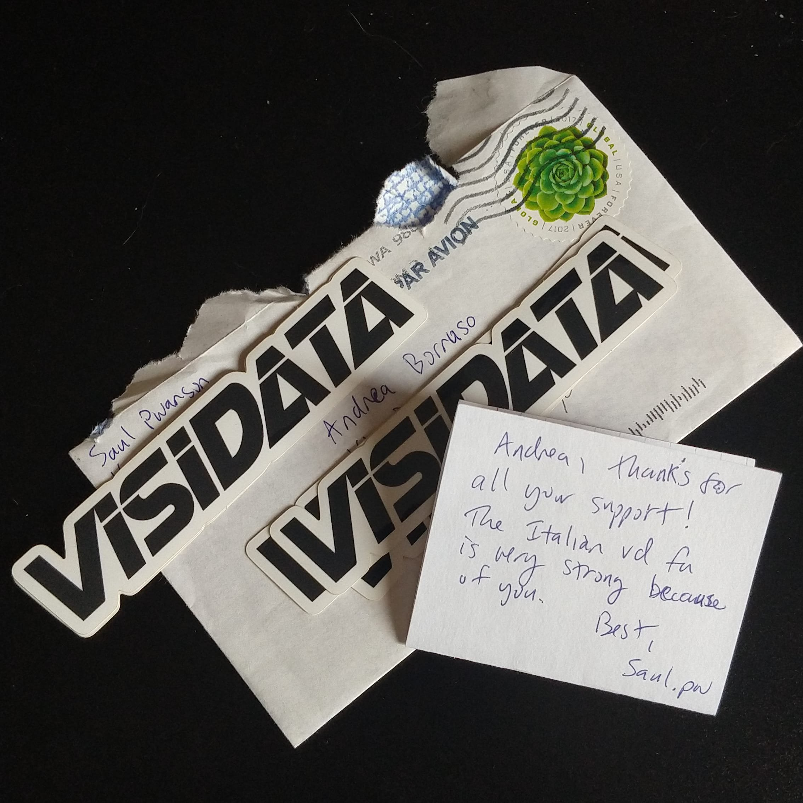

# Note personali

(di `Andrea Borruso`)

Il grande **Jeremy Singer Vine** usa VisiData da molto più tempo di me e ha creato la [migliore guida introduttiva dedicata](https://jsvine.github.io/intro-to-visidata/), di cui sono felice di essere nei [ringraziamenti](https://jsvine.github.io/intro-to-visidata/#acknowledgments). Ne ho attinto a piene mani per scrivere questa guida e colgo l'occasione per **ringraziarlo di cuore** pubblicamente.

VisiData è un'applicazione molto bella, che probabilmente per alcuni diverrà (come è adesso per me) di uso quotidiano.
 [Jeremy](https://jsvine.github.io/intro-to-visidata/the-big-picture/what-is-visidata/#why-not-use-visidata) afferma che per analisi complesse, analisi geospaziali, _data literature_ è meglio usare altro. Mi sembra sensato.

**Non sostituisce** `R` o `pandas`, ma li **può** certamente **affiancare** e spesso **precedere** nel workflow di lavoro sui dati. È un altro strumento che consiglio di aggiungere nella cassetta degli attrezzi.

Lo sviluppatore principale di VD e le persone  che collaborano con lui sono molto attenti alle richieste e alle proposte che vengono dall'esterno, in una bella mescolanza di sensibilità "tecnologica" e umana.  Ho aperto nel tempo diverse _issue_ a cui è stato dato sempre riscontro. Alcune erano richieste da uomo primitivo, altre erano buone: confesso di essere **orgoglioso** di avere avuto degli effetti nel rilascio della versione `1.5.1` e di essere citato più volte nelle [note di rilascio](https://github.com/saulpw/visidata/releases/tag/v1.5.1).

Qui vorremmo **aggiornare** e **arricchire** nel tempo i testi e [si accettano anche **proposte** di **integrazioni**, **correzioni** e **modifiche**](https://github.com/ondata/guidaVisiData/discussions).

Alcuni **grazie**:

- a [**Saul Pwanson**](https://www.saul.pw/), per avere inventato VisiData e per essere una persona brillante e generosa;
- a [**Anja Kefala**](https://github.com/anjakefala), per essere sempre presente e attenta nelle gestione delle issue di progetto e per il contributo allo sviluppo di VisiData;
- a [**Jeremy Singer-Vine**](https://www.jsvine.com/), per aver scritto [la guida VisiData più bella](https://jsvine.github.io/intro-to-visidata/), per essere una continua fonte di ispirazione;
- a [**Ciro Spataro**](https://twitter.com/cirospat), [**Gianni Vitrano**](https://twitter.com/gbvitrano) e [**Totò Fiandaca**](https://twitter.com/totofiandaca), che seguono questa guida dalla sua prima versione, per i loro contributi e i tanti suggerimenti e stimoli;
- a [**Martin Donath**](https://twitter.com/squidfunk), per avere inventato [Material for MkDocs](https://github.com/squidfunk/mkdocs-material) (il motore di questa guida).

---

## URL consigliati

- la guida di **Jeremy Singer Vine** [https://jsvine.github.io/intro-to-visidata/](https://jsvine.github.io/intro-to-visidata/)
- le ricette sul sito ufficiale [http://visidata.org/docs/](http://visidata.org/docs/);
- la documentazione ufficiale [http://visidata.org/man/](http://visidata.org/man/);
- la playlist YouTube a cura dell'autore [https://www.youtube.com/playlist?list=PLxu7QdBkC7drrAGfYzatPGVHIpv4Et46W](https://www.youtube.com/playlist?list=PLxu7QdBkC7drrAGfYzatPGVHIpv4Et46W);
- la lista visuale degli shortcut da tastiera [http://visidata.org/docs/kblayout/](http://visidata.org/docs/kblayout/).

