## Indice

<!-- TOC -->

- [VisiData: il coltellino svizzero per i dati, che probabilmente non conosci](#visidata-il-coltellino-svizzero-per-i-dati-che-probabilmente-non-conosci)
  - [Perché usarlo](#perché-usarlo)
  - [Supportarne lo sviluppo](#supportarne-lo-sviluppo)
  - [Come si installa](#come-si-installa)
  - [Cheat-sheet](#cheat-sheet)
    - [La versione fronte retro a cura di Gianni Vitrano](#la-versione-fronte-retro-a-cura-di-gianni-vitrano)
  - [10 Modi di usare Visidata](#10-modi-di-usare-visidata)
  - [La guida](#la-guida)
      - [Un esempio di apertura di un file grande](#un-esempio-di-apertura-di-un-file-grande)
      - [Navigare tra i dati](#navigare-tra-i-dati)
    - [I fogli](#i-fogli)
    - [Lavorare sulle righe](#lavorare-sulle-righe)
      - [Selezione di righe tramite espressione regolare](#selezione-di-righe-tramite-espressione-regolare)
      - [Selezione di righe tramite espressioni Python](#selezione-di-righe-tramite-espressioni-python)
      - [Selezione di righe tramite espressioni Python e regex](#selezione-di-righe-tramite-espressioni-python-e-regex)
      - [Selezionare un numero random di righe](#selezionare-un-numero-random-di-righe)
      - [Spostare righe](#spostare-righe)
      - [Cancellare righe](#cancellare-righe)
      - [Modificare il contenuto](#modificare-il-contenuto)
    - [Lavorare sulle colonne](#lavorare-sulle-colonne)
      - [Il foglio delle colonne](#il-foglio-delle-colonne)
      - [Impostare il tipo di campo](#impostare-il-tipo-di-campo)
        - [Impostare numero di decimali in un campo floating](#impostare-numero-di-decimali-in-un-campo-floating)
      - [Rinominare le colonne](#rinominare-le-colonne)
      - [Rinominare le colonne in blocco](#rinominare-le-colonne-in-blocco)
      - [Come espandere, ridurre e rimuovere colonne](#come-espandere-ridurre-e-rimuovere-colonne)
      - [Spostare una colonna](#spostare-una-colonna)
      - [Modificare una colonna tramite un'espressione Python](#modificare-una-colonna-tramite-unespressione-python)
      - [Calcoli per colonna](#calcoli-per-colonna)
      - [Come definire una colonna chiave](#come-definire-una-colonna-chiave)
      - [Manipolare le colonne dal foglio delle colonne](#manipolare-le-colonne-dal-foglio-delle-colonne)
      - [Creare una nuova colonna](#creare-una-nuova-colonna)
        - [Nuova colonna tramite espressione](#nuova-colonna-tramite-espressione)
        - [Nuove colonne come risultato di splitting](#nuove-colonne-come-risultato-di-splitting)
        - [Nuove colonne come risultato di cattura e estrazione](#nuove-colonne-come-risultato-di-cattura-e-estrazione)
      - [Trasformare una colonna tramite espressione regolare (trova e sostituisci)](#trasformare-una-colonna-tramite-espressione-regolare-trova-e-sostituisci)
      - [Il foglio delle frequenze](#il-foglio-delle-frequenze)
    - [Lavorare sulle celle](#lavorare-sulle-celle)
      - [Fare un trova e sostituisci globale](#fare-un-trova-e-sostituisci-globale)
    - [Ordinare e filtrare](#ordinare-e-filtrare)
      - [Ordinare righe](#ordinare-righe)
      - [Filtrare righe](#filtrare-righe)
        - [Filtro tramite espressione Python](#filtro-tramite-espressione-python)
    - [Riepilogo dei dati](#riepilogo-dei-dati)
      - [Aggiunta di aggregatori](#aggiunta-di-aggregatori)
      - [Il riepilogo globale](#il-riepilogo-globale)
    - [Salvare un foglio](#salvare-un-foglio)
    - [Fare JOIN tra tabelle](#fare-join-tra-tabelle)
    - [Concatenare tabelle](#concatenare-tabelle)
    - [Tabelle Pivot](#tabelle-pivot)
    - [Creare un grafico di dispersione (scatter plot)](#creare-un-grafico-di-dispersione-scatter-plot)
    - [Moduli Python](#moduli-python)
    - [Salvare un flusso di lavoro](#salvare-un-flusso-di-lavoro)
      - [Introduzione](#introduzione)
      - [Applicare lo stesso flusso a un file diverso, ma omologo](#applicare-lo-stesso-flusso-a-un-file-diverso-ma-omologo)
      - [Nota sul file di log](#nota-sul-file-di-log)
    - [Soluzione problemi](#soluzione-problemi)
      - [Riga attiva di colore nero](#riga-attiva-di-colore-nero)
      - [Caratteri non leggibili in Windows Subsystem for Linux](#caratteri-non-leggibili-in-windows-subsystem-for-linux)
    - [Ricette](#ricette)
      - [Salvare una tabella HTML in CSV, a partire da una pagina web](#salvare-una-tabella-html-in-csv-a-partire-da-una-pagina-web)
    - [Fare proposte e/o Chiedere supporto](#fare-proposte-eo-chiedere-supporto)
    - [Note finali](#note-finali)
    - [URL consigliati](#url-consigliati)

<!-- /TOC -->


# VisiData: il coltellino svizzero per i dati, che probabilmente non conosci

> **VisiData** è un fantastico strumento _open source_ per esplorare e manipolare dati. Mette insieme la chiarezza di un **foglio di calcolo**, con l'efficienza del **terminale** e la potenza di **Python**, in una _utility_ leggera in grado di gestire milioni di righe con facilità.

La presentazione ufficiale fa un'ottima sintesi, ma non evidenzia la cosa che mi ha colpito di più:  quella di [**Saul Pwanson**](http://saul.pw/) (il creatore di VisiData) è prima di ogni altra cosa una **grande idea**. Lo si capisce usandolo e spero che emerga anche dalle righe seguenti.

Per usarlo **non è necessario essere uno sviluppatore**; se si conosce un po' Python, sarà possibile usarlo in modo ancora più sorprendente.

[`torna su`](#indice)

## Perché usarlo

- È **rapido**, apre quasi istantaneamente file di diverse decine di **megabyte**;
- è **agile**, rende semplice la **ricerca**, il **filtraggio**, l'**ordinamento**,il _**join**_ e la ristrutturazione  di dati tabellari;
- consente di **avere in pochi passaggi** una **visione di insieme dei dataset** su cui si vuole lavorare;
- apre **molti** dei **formati** **tipici** di testo strutturato (csv, tsv,  xlsx , xls, json, xml, sqlite, shp, html, hdf5, xpt, sas7bdat, sav, dta)
- si utilizza **soltanto da tastiera**, ed è possibile dimenticarsi del mouse;
- è free ed _**open source**_.

Apprezzo molto la sua rapidità e come offra in modo agile una visione di insieme sui dati. Questo, affiancato all'utilizzo da tastiera, lo rende un prodotto che dà una marcia in più a chi lo usa.

[`torna su`](#indice)

## Supportarne lo sviluppo

Se VisiData vi piacerà e lo utilizzerete, sarà cosa buona **supportarne lo sviluppo con una donazione**. Io ho deciso di farlo e di esserne un "patrono"!

Si fa da qui [https://www.patreon.com/saulpw](https://www.patreon.com/saulpw).

## Come si installa

Per gli sviluppatori, per chi usa la riga di comando, [è molto facile](http://visidata.org/install/). È scritto in _Python 3_ e di base basta usare l'installer di Python:

    pip3 install visidata

Per tutti gli altri, bisogna prima installare _Python 3_, poi aprire il terminale e lanciare il comando di sopra.<br>
Su Windows non c'è ancora un supporto diretto. È però utilizzabile da chi ha Windows 10: c'è da installare il Windows Linux Subsystem ([decine di guide per farlo](https://www.google.it/search?q=installare+bash+su+windows+10&rlz=1C1GGRV_itIT742IT742&source=lnt&tbs=qdr:y&sa=X&ved=0ahUKEwj3xd7p5rrfAhVJ-6QKHarKC90QpwUIJg&biw=1680&bih=907)), poi installare _Python 3_ nel sistema Linux e infine dare il comando di sopra dal terminale di Linux.

[`torna su`](#indice)

## Cheat-sheet

Abbiamo tradotto in italiano il *cheat-sheet* di VisiData, creato da Jeremy Singer Vine, disponibile in [HTML](https://jsvine.github.io/visidata-cheat-sheet/it/) e [PDF](https://jsvine.github.io/visidata-cheat-sheet/downloads/visidata-cheat-sheet.it.pdf).

[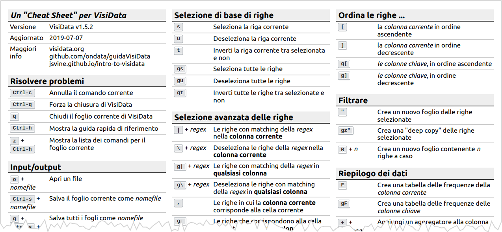](https://jsvine.github.io/visidata-cheat-sheet/it/)

### La versione fronte retro a cura di Gianni Vitrano

[**Gianni Vitrano**](https://twitter.com/gbvitrano) di [OpenDataSicilia](https://twitter.com/opendatasicilia) a partire da questo cheat-sheet, ha creato la versione da stampare [fronte retro a "libretto"](./risorse/cheat-sheet_DaStampareFronteRetro_di_GianniVitrano.pdf). Grazie Gianni!

[`torna su`](#indice)

## 10 Modi di usare Visidata

[**Dieci esempi rapidi**](./dieci_modi_di_usare_visidata.md), che mostrano cosa è possibile fare con VisiData. È una sezione a cura di [**Salvatore Fiandaca**](https://twitter.com/totofiandaca) (grazie).

## La guida

VisiData è un **foglio elettronico a riga di comando**. Potrebbe suonare come una contraddizione, perché si accosta qualcosa con interfaccia ricca (come un foglio elettronico) a qualcosa di visualmente molto minimale. In realtà questa è **una delle idee forti** di questa applicazione, che prende il meglio di questi due mondi: l'approccio a griglia e multi tabella del primo, e la rapidità, l'immediatezza, l'essere _easy_ e "subito pronto" di un terminale.


Di base quindi bisogna prima aprire il terminale. Poi per aprire un file basta scrivere un comando con questa struttura:

    vd nomeFile.csv

A seguire soltanto un piccolo estratto sul come usarlo. Per approfondire ho creato un elenco di [URL consigliati](#url-consigliati).

VisiData si usa al 99% con la tastiera, quindi è bene che il <kbd>Caps Lock</kbd> non sia attivo: gli *shortcut* da tastiera non funzionerebbero correttamente (grazie [Salvatore Fiandaca](https://twitter.com/totofiandaca) per la nota).

[`torna su`](#indice)

#### Un esempio di apertura di un file grande

"Grande" in informatica non vuol dire niente, è come "salato" con un piatto di pasta.

Un CSV grande per il mio PC (un notebook del 2015, con processore i7 e 8 GB di RAM) - se voglio lavorarci in modo "visuale" con un foglio elettronico - potrebbe essere già un CSV da 500000 righe, che mi si apre dopo 1 minuto e 15 secondi e dove un "trova e sostituisci" diventa operazione molto lunga (uso LibreOffice Calc).

Ci sono anche limiti che non sono personali. Se per esempio provassi a lavorare con uno dei dataset del "[Parco Circolante dei veicoli](http://dati.mit.gov.it/catalog/dataset/parco-circolante-dei-veicoli)" in Italia scoprirei dei limiti strumentali. <br>Un esempio con i dati dell'[Abruzzo](http://geodata.mit.gov.it/datasets/parco_circolante_Abruzzo.csv): con il comando da shell `wc -l parco_circolante_Abruzzo.csv` leggo che è composto da 1170439 righe.
Con una regione "piccola" come questa si va già oltre il limite di Calc, che è di 1048576 righe. Se voglio comunque visualizzare 1048576 righe di questo dataset, sul mio PC sono necessari circa **5 minuti**.

Con **VisiData** lancio `vd parco_circolante_Abruzzo.csv` e lo visualizzo **in 1 secondo**. C'è il "trucco", che è  invero una delle buone scelte del progettista: il file viene aperto in modo asincrono, caricandone subito una porzione navigabile. In basso a destra (vedi sotto) viene dato conto della percentuale di avanzamento che porterà alla piena apertura (meno di 15 secondi).


Questo essere "subito pronto" lo rende uno strumento di grande comodità, che l'ha portato a essere uno dei miei quotidiani.<br>
Ribadisco però ancora un volta che il "grande" e la valutazione del tempo dipendono dagli obiettivi che si hanno, dalle proprie conoscenze di base e dall'_hardware/software_ che si ha a disposizione.

Per chiudere la tabella aperta e Visidata si pigia `q` sulla tastiera.

**NOTA BENE**: questo file con i dati sul "Parco Circolante dei veicoli" in Abruzzo, verrà usato in questa guida come dataset di base. Ne ho pertanto creato una copia di backup [qui](../dati/parco_circolante_Abruzzo.zip).

[`torna su`](#indice)

#### Navigare tra i dati

Per muoversi tra le celle si usano le 4 frecce direzionali dalla tastiera o (come vim, da cui nell'uso da tastiera VisiData prende molta ispirazione) `h`,`j`,`k`,`l`.

Per muoversi in modo più esteso:

- `g + freccia in basso` oppure `gj`, per andare all'ultima riga;
- `g + freccia in alto` oppure `gk`, per andare alla prima riga;
- `g + freccia a sinistra` oppure `gh`, per andare alla colonna più a sinistra;
- `g + freccia a destra` oppure `gl`, per andare alla colonna più a destra;
- `PageDown` oppure `Control + Shift + f`, una pagina in giù;
- `PageUp` oppure `Control + Shift + b`, una pagina in alto.

**NOTA BENE**: `g` è il tasto per i comandi "globali".

Per muoversi tramite ricerca testuale, sfruttando le espressioni regolari:

- `/ + regex`, cerca in avanti nella colonna corrente;
- `? + regex`, cerca indietro nella colonna corrente;
- `g/ + regex`,	cerca in avanti in tutte le colonne;
- `g? + regex`,	cerca indietro in tutte le colonne;

Con `n` e `N` si va avanti e indietro rispetto agli elementi di _output_ del risultato della ricerca.

Infine per saltare a una determinata riga o colonna, rispettivamente `zr` e `zc` seguito dal numero di riga e colonna (la numerazione inizia da zero).

[`torna su`](#indice)

### I fogli

In VisiData ci sono tre tipi di fogli:

- i fogli sorgente, con i dati che si è scelto di aprire con VisiData;
- i fogli derivati, come quelli derivanti da filtraggio o la tabelle con le frequenze (vedi sotto);
- i metafogli, che descrivono e definiscono i dataset caricati (come quello che descrive ad esempio le colonne di una tabella, o il "foglio dei fogli").

Il "foglio dei fogli" si apre con `Shift + s` e fornisce l'elenco (e alcune informazioni correlate) di tutti i fogli aperti. Selezionandone uno e pigiando `Invio`, quest'ultimo si aprirà.


Per rinominarne uno dal "foglio dei fogli", basta selezionarlo, premere `e` e inserire il nuovo nome e poi dare `Invio`. O in alternativa, se si è davanti al foglio che si vuole rinominare, premere la `barra spaziatrice`, scrivere `rename-sheet`, digitare il nuovo nome e infine pigiare su `Invio`.

Il foglio correntemente aperto si chiude con `q`.

[`torna su`](#indice)

### Lavorare sulle righe

La cosa più importante da comprendere è come selezionarle e deselezionarle, perché molte delle operazioni vengono  eseguite proprio su quelle selezionate.

I tasti principali di selezione sono:

- `s`, per selezionare la riga corrente;
- `u`, per deselezionare la riga corrente;
- `t`, per invertire la selezione della riga corrente;
- `gs`, per selezionare tutte le righe;
- `gu`, per deselezionare tutte le righe;
- `gt`, per invertire i criteri di selezione per tutte le righe.

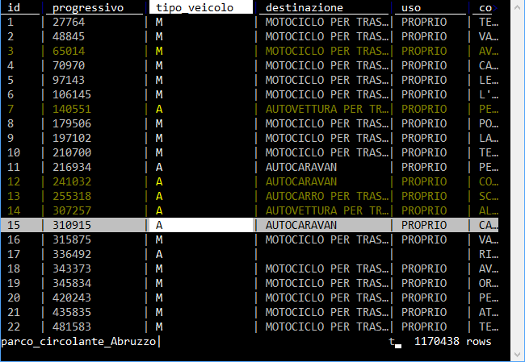

#### Selezione di righe tramite espressione regolare

- `| + termine da ricercare`, seleziona tutte le righe in cui c'è corrispondenza per la colonna corrente;
- `\ + termine da ricercare`, deseleziona tutte le righe in cui c'è corrispondenza per la colonna corrente;
- `g| + termine da ricercare`, seleziona tutte le righe in cui c'è corrispondenza per una qualsiasi colonna;
- `g\ + termine da ricercare`, deseleziona tutte le righe in cui c'è corrispondenza per una qualsiasi colonna;
- `,`, dato il valore della cella selezionata, seleziona tutte le righe in cui per la colonna corrente c'è corrispondenza;
- `g,`, seleziona tutte le righe uguali a quelle corrente.

Se ad esempio:

- ci si sposta nella colonna `provincia_residenza`
- poi si pigia `|`;
- si digita `TERAMO`;
- si preme `Invio`.

... si ottiene qualcosa come quella di sotto.


[`torna su`](#indice)

#### Selezione di righe tramite espressioni Python

È possibile fare una selezione di righe tramite un'espressione di Python ([qui](https://docs.python.org/3/tutorial/introduction.html) per approfondire sui concetti di base delle espressioni).

I comandi da tastiera sono:

- `z|`, per selezionare tutte le righe in cui l'espressione è valida;
- `z\`, per deselezionare tutte le righe in cui l'espressione è valida.

Ad esempio seguendo questi step:

- `gu`, per deselezionare tutto;
- `z|`, per attivare la selezione tramite espressione Python;
- scrivendo `provincia_residenza == "PESCARA" and sesso == "F"`;
- e pigiando su `Invio`.

... verranno selezionati tutti gli elementi in cui la provincia è "Pescara" ed il sesso è "F".

[`torna su`](#indice)


#### Selezione di righe tramite espressioni Python e regex

- si digita `z|`;
- si scrive l'espressione, come ad esempio `re.search("^1", FieldB) and re.search("^2", FieldA)`, ovvero tutte le righe in cui il campo `FieldB` inizia per `1` e il campo `FieldA` per `2`.

#### Selezionare un numero random di righe

- aprire una tabella;
- fare click sulla barra spaziatrice;
- scrivere `random-rows` (si può scrivere anche soltanto ad esempio `ran` e autocompletare con `TAB`) e premere `INVIO`;
- scrivere il numero di righe random che si vogliono selezionare.

[`torna su`](#indice)

#### Spostare righe

Si fa con queste combinazioni:

- `Shift+j`, per spostare la riga corrente verso il basso;
- `Shift+k`, per spostare la riga corrente verso l'alto.

#### Cancellare righe

- `d` per cancellare la riga corrente;
- `gd` per cancellare le righe selezionate.

#### Modificare il contenuto

Questi i comandi di base:

- `e`, per modificare la cella corrente;
- `Enter`, per chiudere la modifica;
- `Control+c`, per cancellare la modifica;
- `Control+a`, per andare a inizio linea;
- `Control+e`, per andare a fine linea;
- `Control+k`, per cancellare il contenuto a partire dalla posizione del cursore.

[`torna su`](#indice)

### Lavorare sulle colonne

Ogni colonna in VisiData ha 3 attributi principali:

- `Name`, il nome della colonna;
- `Width`, la larghezza a schermo della colonna (se impostata a 0, la colonna diventa invisibile);
- `Type`, per definire se contiene testi, numeri interi, numeri decimali, monete o date.

#### Il foglio delle colonne

In VisiData esistono i cosiddetti meta-fogli (vedi [sopra](#i-fogli)): uno di questi è il foglio delle colonne, che elenca tutte le colonne e i relativi attributi di una tabella.

A partire dalla visualizzazione di una tabella, si apre con `Shift+c`.


È una delle caratteristiche di VisiData che consente una rapida prima lettura del dato, che personalmente uso anche ad esempio per costruire brevi relazioni che contengono schema dati.

#### Impostare il tipo di campo

Come impostazione predefinita VisiData imposta a "testo" la tipologia di tutti i campi (che è quello che faccio di solito anche io alla prima apertura sia in un foglio elettronico che in Pandas).<br>
Per definire il tipo di campo di una colonna della tabella che si sta visualizzando (cosa che consente di fare correttamente ad esempio operazioni di ordinamento, matematiche, ecc.), si deve navigare sino alla colonna su cui si vuole intervenire e poi pigiare:

- `#`, per definire un campo con numeri interi (0, -1, 5000000)
- `%`, per definire un campo con numeri decimali (0.5, -3.14, 23.45557)
- `$`, per definire un campo con monete ($4.99, €20)
- `@`, per definire un campo con date (2018-04-06, April 6, 2018, 04/06/2018)
- `~`, per definire un campo di testo (qualsiasi cosa!)

[`torna su`](#indice)

##### Impostare numero di decimali in un campo floating

Di *default* i campi floating sono renderizzati con due decimali (la formattazione è impostata come `%.02f`).

Per modificare la cosa si può aprire il foglio delle colonne (`SHIFT+c`) e modificare il valore di formattazione delle colonna `fmtstr` (vedi sotto).


Per passare a tre decimali per un campo, basterà ad esempio modificare la cella della colonna di interesse da `%.02f` a `%.03f` (in edit di cella si va con il tasto `e`).<br>
Se si vuole fare su più colonne:

- si apre sempre il foglio delle colonne;
- si selezionano le colonne di cui si vuole cambiare la formattazione;
- si va sulla colonna `fmtstr`;
- si va in modifica globale con `ge` e si inserisce il valore di formattazione desiderato;
- si preme `INVIO` per applicare la modifica.

[`torna su`](#indice)

#### Rinominare le colonne

Per farlo si naviga sino alla colonna che si vuole rinominare e poi:

- si pigia `^`;
- si digita il nome che si vuole assegnare;
- si pigia `Invio`.

#### Rinominare le colonne in blocco

Può essere utile ad esempio anteporre dei caratteri a tutte le colonne che iniziano per `t`.

Questi i passi:

- si apre il foglio colonne con `shift + c`;
- si va nella colonna con il nome delle colonne (è la prima);
- si digita `|`, si scrive `^t` e si pigia `INVIO` (saranno selezionate tutte le colonne che iniziano con il carattere `t`);
- si pigia `g*`, per attivare il trova e sostituisci via *regex*;
- si scrive `^(t.+)/TR_\1` e poi `INVIO`.

Tutte le colonne che iniziano per `t`, avranno un nuovo nome corrispondente al precedente, con `TR_` come prefisso. La colonna `tabacco`, diventerebbe ad esempio `TR_tabacco`.

[`torna su`](#indice)

#### Come espandere, ridurre e rimuovere colonne

Questi gli shortcut:

- `_`, per espandere la larghezza della colonna corrente, alla larghezza massima del testo contenuto nella stessa, tenendo conto delle righe visualizzate a schermo;
- `g_`, per espandere la larghezza di tutte le colonne, alla larghezza massima del testo contenuto, tenendo conto delle righe visualizzate a schermo;
- `z_ + n`, per	impostare la larghezza della colonna corrente a `n` caratteri;
- `-`, per nascondere la colonna corrente (viene impostata a 0 la sua larghezza);
- `gv`, per	scoprire tutte le colonne nascoste;
- `z-`, per	ridurre la larghezza della colonna corrente alla sua metà.

[`torna su`](#indice)

#### Spostare una colonna

Ecco come farlo:

- `Shift+h`, sposta la colonna corrente di una posizione a sinistra;
- `Shift+l`, sposta la colonna corrente di una posizione a destra.

#### Modificare una colonna tramite un'espressione Python

A questa tabella si vuole assegnare al campo `FieldA` il valore di `FieldB`, tutte le volte che `FieldA` è vuoto.

| FieldA | FieldB |
| --- | --- |
| 1 |  |
|  | 3 |
| 1 | 12 |

Questa la procedura:

- `gs` per selezionare tutte le righe;
- `g=` per scrivere l'espressione Python;
- aggiungere come espressione `FieldB if FieldA=="" else FieldA`.

Ovvero (`FieldA`) è uguale `FieldB` se `FieldA` non contiene nulla, altrimenti è uguale a se stesso (rimane invariato).

[`torna su`](#indice)

#### Calcoli per colonna

È possibile avere restituito, per una colonna, il risultato di uno dei calcoli di aggregazione disponibili:

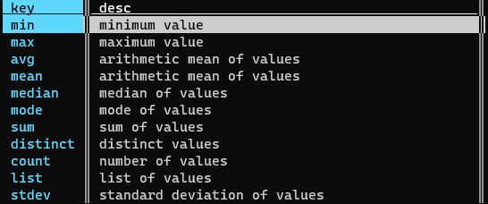

Ad esempio per avere la somma dei valori di una colonna con numeri interi:

- si imposta il tipo di colonna a numero intero (con `#`);
- si digita `z+` e poi `INVIO`;
- si digita `sum` e poi `INVIO`.

In basso, si leggerà il valore risultante.

**NOTA BENE**: se nessuna riga è selezionata si avrà il totale per colonna, altrimenti il calcolo sarà applicato per colonna alle sole righe selezionate.

#### Come definire una colonna chiave

Per ogni foglio è possibile definire una o più colonne chiave. Hanno due funzioni principali:

- rimangono fissate sul lato sinistro, quando si naviga orizzontalmente sulla tabella;
- hanno una funzione speciale quando si fanno certe operazioni (come quelle di _JOIN_, per alcuni conteggi, ecc.).

Per definire una colonna chiave (e vice-versa) si naviga sino alla colonna di interesse e si pigia `!`.

[`torna su`](#indice)

#### Manipolare le colonne dal foglio delle colonne

Il foglio delle colonne oltre a dare una visione di insieme, consente di fare delle rapide modifiche in blocco. È possibile spostare le colonne con `Shift+j` e `Shift+k`, rinominarle con `e`, impostare il tipo per tutte quelle selezionate, impostare la larghezza per tutte quelle selezionate.

Ad esempio a partire dal Parco Circolante dei veicoli dell'Abruzzo, il foglio colonne (`Shift+c`) appare in questo modo.


Se si vuole impostare a "numero intero" le colonne `progressivo` e `eta_intestatario`, bisognerà prima selezionarle con `s`.

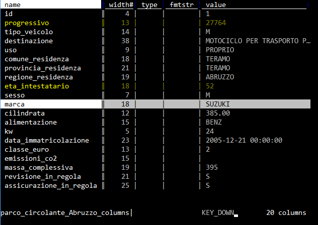

Poi premere `g#`.

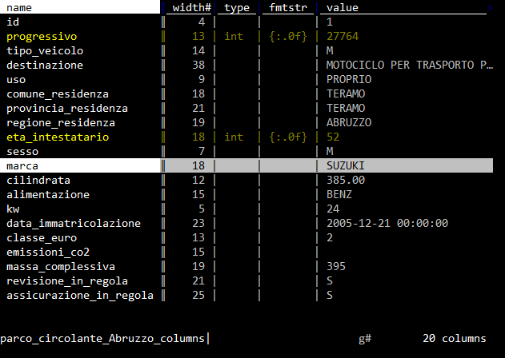

[`torna su`](#indice)

#### Creare una nuova colonna

Sono tre le modalità più comode:

- come risultato di un'espressione Python;
- come risultato di un comando di _split_;
- come risultato di estrazione di una porzione di testo da una colonna.

##### Nuova colonna tramite espressione

Ad esempio potrebbe essere utile creare una colonna vero/falso, per tutte le auto del Parco Circolante dei veicoli dell'Abruzzo, con cilindrata maggiore ai 643 (è un numero a caso). Per farlo:

- navigare sino alla colonna `cilindrata`;
- premere `%` per impostarla come numero decimale;
- pigiare su `=`;
- nel _prompt_ in basso a sinistra scrivere `cilindrata > 643`;
- premere `Invio`.

In output qualcosa come quella di sotto, con la nuova colonna risultato di un'espressione Python.

[`torna su`](#indice)


##### Nuove colonne come risultato di splitting

Si possono creare nuove colonne, come risultato di una suddivisione di una già esistente. Ad esempio nel campo `data_immatricolazione` è contenuta sia la data che l'orario, separati da spazio (i.e. `1995-04-03 00:00:00`). <br>
Se si vuole suddividerla in due colonne (data e orario), si può procedere in questo modo:

- si naviga sino alla colonna `data_immatricolazione`;
- si preme `:`;
- si sceglie la stringa di testo (definibile anche come espressione regolare) da usare come separatore e si scrive in basso a sinistra nel _prompt_. In questo caso è lo spazio;
- si digita quindi lo spazio e si dà `Invio`.

Come output si avrà qualcosa come quella di sotto: due colonne frutto della divisione in più colonne, sfruttando come separatore lo spazio.

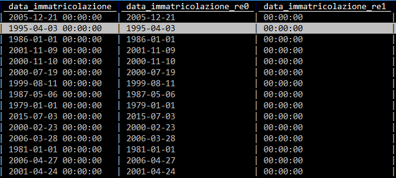

[`torna su`](#indice)

##### Nuove colonne come risultato di cattura e estrazione

Per farlo ci vogliono delle conoscenze di base sulle espressioni regolari (che sono una conoscenza propedeutica per chiunque lavori con i dati).

Se si vuole ad esempio estrarre l'anno dalla celle che contiene il valore `1995-04-03 00:00:00`, basterà definire l'espressione regolare che estrae a partire dall'inizio della cella i primi 4 numeri. Che in termini di espressione regolare è `^[0-9]{4}`.

Per creare una nuova colonna a partire dalla definizione di un'espressione regolare da usare come "estrattore", si procede in questo modo:

- si naviga sulla colonna `data_immatricolazione`;
- si pigia `;`;
- si scrive nel prompt in basso a sinistra `^([0-9]{4})`. Sono state inserite le parentesi tonde, perché la cattura si fa a partire dalla definizione di un gruppo;
- si pigia `Invio`.

E si ottiene qualcosa come quella di sotto:


[`torna su`](#indice)

#### Trasformare una colonna tramite espressione regolare (trova e sostituisci)

Su ogni colonna è possibile fare delle trasformazioni basate su espressioni regolari. Se ad esempio si vogliono rimuovere dalle celle della colonna `data_immatricolazione` le informazioni sull'orario e passare quindi da `1995-04-03 00:00:00` a `1995-04-03` si può procedere in questo modo:

- si selezionano le righe su cui si vuole fare questa trasformazione (se sono tutte il comando è `gs`);
- si va nella colonna `data_immatricolazione`;
- si pigia su `g*`;
- si scrive nel prompt ` .*$/`. Il simbolo `/` in VisiData separa ciò che si cerca, da ciò con cui si vuole sostituire. Qui si cerca uno spazio (` `), seguito da qualsiasi carattere sino a fine cella (`.*$`), e si vuole sostituire con nulla;
- si pigia `Invio` (ci vorrà un po' di tempo, sono più di un milione di righe).

Il risultato sarà qualcosa come quella di sotto:

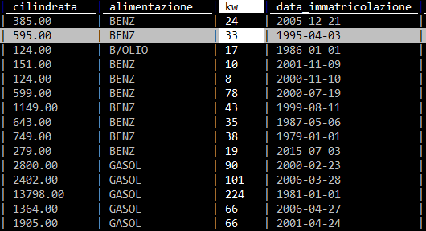

Questo è un "trova e sostituisci" per colonna.

[`torna su`](#indice)

#### Il foglio delle frequenze

Questa è una delle funzioni che uso di più ed è un'altra gran bell'idea. A partire da una colonna (o dalla combinazione di più d'una) è possibile - con `Shift+f` - aprire un foglio derivato, che contiene dei dati relativi al conteggio per valori distinti di quanto contenuto in quella colonna.

Se per esempio a partire dal Parco Circolante dei veicoli dell'Abruzzo, si volesse avere un'idea sulla distribuzione per "marca", basta navigare in vista tabella sino a quella colonna e poi pigiare `Shift+f` e avere qualcosa come quella di sotto.

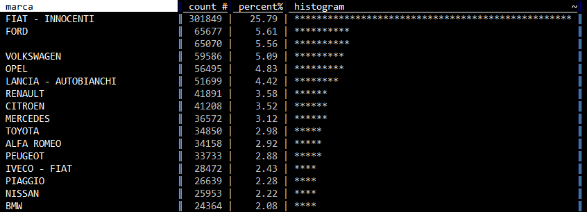

I dati sono ordinati per conteggio ed emerge subito come una famosa marca nazionale da sola faccia 1/4 del campione. Così come emerge che c'è un 5% di elementi in cui la marca non è definita e anche questa è un'informazione che ci potrebbe consentire da subito di prendere delle decisioni. <br>Molto comoda anche la colonna `histogram` che da visivamente in modo molto diretto un'idea del rapporto tra i numeri descritti in tabella.

[`torna su`](#indice)

### Lavorare sulle celle

#### Fare un trova e sostituisci globale

Si parte dal selezionare le righe su cui si vuole eseguire l'operazione (se sono tutte il comando è `gs`).

Digitare <kbd>gz*</kbd> e poi scrivere `stringa da trovare`/`stringa da sostituire` e dare <kbd>INVIO</kbd>.

Se ad esempio volessi sostituire la stringa `pal` con `mis`, dovrei scrivere `pal/mis`.

È possibile usare anche le espressioni regolari.

### Ordinare e filtrare

#### Ordinare righe

I tasti `[` e `]` ordinano i dati rispettivamente in modo crescente e decrescente, a partire dalla colonna attiva.

#### Filtrare righe

È possibile estrarre in vari modi un campione delle righe della tabella visualizzata. Quello di base è a partire dalla selezione delle righe (in uno dei modi visti sopra) e poi pigiare `"`. Ad esempio si naviga sino alla colonna `marca`, si preme `|`, si scrive `chevr`, si pigia `Invio` (vengono selezionati tutti i record associati a `CHEVROLET`) e infine si preme `"`. Si avrà una tabella filtrata, con gli 8814 record relativi a questa marca per l'Abruzzo.

Oppure posso farlo a partire da un "foglio delle frequenze" (vedi [qui](#il-foglio-delle-frequenze)):

- si naviga sino alla colonna `marca`;
- si pigia `Shift+f`, che mi da in _output_ il conteggio dei valori distinti per marca (sono più di un milione di record, ci vorrà un po' di tempo);
- si scorre sino alla riga che contiene la marca che si vuole filtrare;


- si pigia `Invio` e si avrà una tabella filtrata, con i record relativi a quella marca per l'Abruzzo.

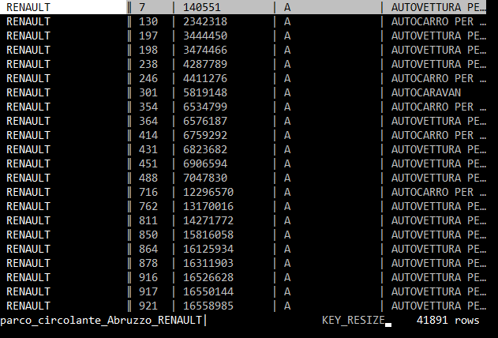

Dal foglio delle frequenze è possibile filtrare su più di un elemento:

- si selezionano ad esempio tre marche, pigiando `s` per ognuna;
- si chiude il foglio delle frequenze con `q` e si torna al foglio dati;
- si pigia `"` e si ottiene una tabella filtrata con i dati relativi alle sole tre marche selezionate prima.

[`torna su`](#indice)

##### Filtro tramite espressione Python

È possibile **filtrare** righe tramite un'**`espressione` Python** ([qui](https://docs.python.org/3/reference/expressions.html) la documentazione ufficiale e [qui](https://realpython.com/python-operators-expressions/) una guida che consiglio).
Se ad esempio dalla tabella di sotto si volessero soltanto le province con più di 350.000 abitanti


basterebbe:

- per prima cosa impostare il campo `Popolazione` come numerico, pigiando <kbd>#</kbd>;
- pigiare `z|` per attivare il filtro tramite espressione Python;
- scrivere l'espressione basata sulla colonna, che qui è `Popolazione>350000` e poi premere <kbd>INVIO</kbd>.

In output si avrà la selezione di tutte le righe che risolvono l'espressione scritta.


Note:

- nel filtro per espressione c'è l'autocompletamento del nome colonna, quindi se si scrive ad esempio `Pop` e poi si fa click su <kbd>TAB</kbd>, viene restituito a schermo `Popolazione`;
- è possibile scrivere espressioni complesse, che fanno riferimento a più colonne.

[`torna su`](#indice)

### Riepilogo dei dati

Uno dei modi per avere un riepilogo è usare il foglio delle frequenze (vedi [qui](#il-foglio-delle-frequenze)).

È possibile generare un foglio delle frequenze anche basato su più colonne. Per farlo si impostano come colonne chiave ([qui](#come-definire-una-colonna-chiave) come fare) quelle che si vogliono trasformare in "foglio delle frequenze", e poi si pigia `g+Shift+f`. Qui sotto ad esempio un riepilogo per le coppie univoche di `destinazione/alimentazione`.

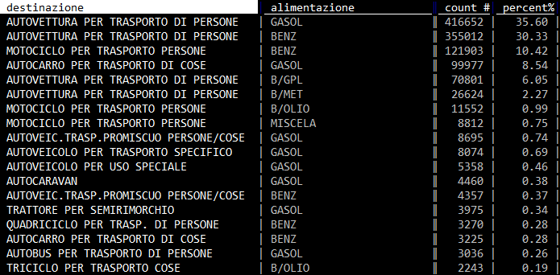

[`torna su`](#indice)

#### Aggiunta di aggregatori

I fogli di frequenza, oltre al conteggio per valori distinti, possono contenere altri calcoli. Gli "aggregatori" possibili sono `min`, `max`, `avg / mean`, `median`, `q3/q4/q5/q10` (terzili/quartili/quintili/decili), `sum`, `distinct`, `count` e `keymax`.

Ad esempio per ogni provincia si può avere restituito la distribuzione di età per quartile e scoprire che il 50% del campione è compreso nella fascia di età tra i 18 e circa i 55 anni.


Per aggiungere l'aggregatore `q4` al foglio delle frequenze, bisogna seguire questi passi:

- navigare sino alla colonna `eta_intestatario` e impostarla a numero intero con `#`;
- premere `+` e scrivere (in basso a sinistra) `q4` (per il calcolo dei quartili, quindi al 25, 50 e 75 percento);
- navigare sino alla colonna `provincia_residenza` e pigiare `Shift+f`.

Inizierà da subito il calcolo (che non è immediato, sono più di un milione di righe) e alla fine si avrà qualcosa come l'immagine di sopra (non è fico VisiData?).

[`torna su`](#indice)

#### Il riepilogo globale

Per avere una visione a "volo d'uccello" sull'intera tabella esiste il comando `Shift+i`, che restituisce un riepilogo statistico per tutte le colonne.<br>
Se prima di lanciarlo si definiscono correttamente i campi (ad esempio i numerici, come numerici), verranno eseguiti correttamente anche i calcoli per `min`, `max`, `median`, `mean`, `stdev`.

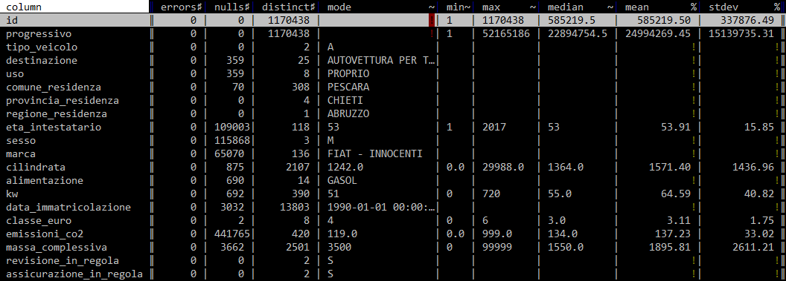

Questa è un'altra _feature_ di grande comodità (presente in molte applicazione e ambienti per analisi dati), che verrà usata molto da chi lavorerà con VisiData.

[`torna su`](#indice)

### Salvare un foglio

Per salvare un foglio si preme `CTRL+s`, poi si scrive il nome del file con estensione (`nomeEsempio.csv`) e infine si pigia `Invio`.

### Fare JOIN tra tabelle

Se ad esempio si volesse calcolare il rapporto tra numero di mezzi e popolazione, sarebbe utile fare un JOIN con una tabella con i dati della popolazione residente.

I dati per provincia sono quelli di sotto e sono stati salvati in un [file TSV](../dati/popolazioneAbruzzo.tsv) denominato [`popolazioneAbruzzo.tsv`](../dati/popolazioneAbruzzo.tsv) (fonte [ISTAT](http://dati.istat.it/Index.aspx?QueryId=18545#)).

| Provincia | Popolazione |
| --- | --- |
| L'AQUILA | 300404 |
| TERAMO | 308284 |
| PESCARA | 319388 |
| CHIETI | 387120 |

Si può fare in questo modo:

- si parte da `vd parco_circolante_Abruzzo.csv`;
- si va sulla colonna `provincia_residenza`;
- si calcola il foglio delle frequenze pigiando `Shift+f` e si ottiene


- si rinomina questo foglio frequenze premendo la barra spaziatrice, scrivendo il comando `rename-sheet` e dando poi `Invio`. E poi inserendo il nome nuovo (ad esempio `mezziProvincia`);
- si apre la tabella con i dati sulla popolazione per provincia, pigiando `o`, scrivendo `popolazioneAbruzzo.tsv` (che è il nome del file) e pigiando `Invio` (NOTA BENE si può scrivere anche soltanto `popo` e poi pigiare `TAB` e il nome del file verrà autocompletato). Si otterrà


- si va nella colonna `Provincia` e si preme `!` per impostarla come colonna chiave. Il JOIN in VisiData viene fatto tra colonne chiave;
- si apre il "foglio dei fogli" con `Shift+s` e si visualizzerà qualcosa come;


- si va nella riga che contiene lo *sheet* `popolazioneAbruzzo` e si pigia <kbd>INVIO</kbd>;
- si va di nuovo nella colonna `Provincia` e si preme `!` per impostarla come colonna chiave;
- si apre il "foglio dei fogli" con `Shift+s`;
- si selezionano con `s` le due tabelle `mezziProvincia` e `popolazioneAbruzzo`;
- si pigia `&` che è il comando di JOIN e in basso a sinistra ci viene chiesto quale tipo si vuole applicare (**nota bene**: con VisiData >2.0 si deve premere `CTRL + x` e scegliere il tipo di `JOIN`);


- si scrive `inner` e si pigia `Invio` e si ottiene una tabella che contiene sia il numero di mezzi per provincia, che il numero di abitanti.


Da questa tabella a questo punto, semplificando un po', si potrebbe rapidamente calcolare il numero macchine per persona, in questo modo:

- si va nella colonna `Popolazione` e si preme `#` per impostarla come numero intero;
- si pigia `=` (per creare una nuova colonna con valori frutto di un'espressione);
- si scrive poi nel _prompt_ `count/Popolazione` (c'è l'autocompletamento con `TAB` dei nomi delle colonne);
- e si ottiene un risultato come quello di sotto.


[`torna su`](#indice)

### Concatenare tabelle

La concatenazione tra due o più tabelle con la stessa struttura si attiva tramite `&`. Ad esempio, a partire dai due file `inputFileOne.csv` e `inputFileTwo.csv`, presenti [qui](https://github.com/ondata/guidaVisiData/tree/master/dati) si procede in questo modo:

- si apre la shell e si va nella cartella che contiene i file da concatenare;
- si scrive `vd` e si preme `Invio`;
- si selezionano con `s` i due file;
- si preme `g Invio` per aprirli entrambi;
- si apre il foglio dei fogli con `Shift+s`;
- si selezionano  `inputFileOne.csv` e `inputFileTwo.csv` con `s`;
- si preme `&` per attivare la concatenazione;
- si scrive `append` e poi si preme `Invio`.

Si avrà a video l'unione dei due file di input (in [questo video](http://youtu.be/NJ8FBYI-WGE?hd=1) una replica di quanto descritto).

[`torna su`](#indice)

### Tabelle Pivot

Ecco ad esempio come creare quella che da conto del numero di mezzi per marca, suddivisi per provincia:

- si va nella colonna `marca` e si imposta come colonna chiave, premendo `!`;
- si va poi nella colonna `provincia_residenza` e si pigia `Shift+w`;
- si ottiene la tabella pivot desiderata.

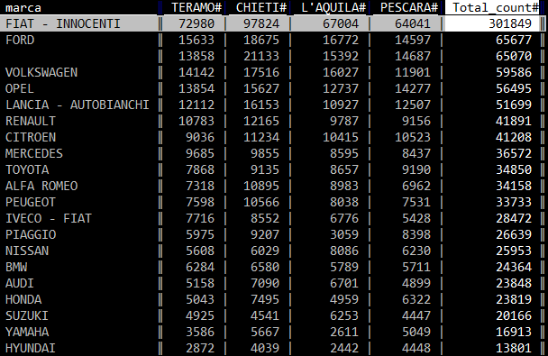

Se invece del conteggio delle occorrenze si volesse (a partire da un altro campo) calcolare un altro dato aggregato  - come ad esempio l'età media per marca e provincia - si può procedere in questo modo:

- si va nella colonna `eta_intestatario` e si imposta a numero intero, pigiando su `#`;
- si preme `+`, poi in basso a sinistra nel _prompt_ si scrive `avg` e infine si dà `Invio`;
si va di nuovo nella colonna `provincia_residenza` e si pigia `Shift+w`.

In output, per ogni provincia, si avrà quindi la media desiderata.


[`torna su`](#indice)

### Creare un grafico di dispersione (scatter plot)

VisiData può stampare a schermo anche dei grafici XY. Non è un suo punto di forza, ma può essere utile per avere una prima e grezza visualizzazione spaziale dell'insieme dei dati.

Il requisito per crearne uno, è avere due colonne numeriche, da usare come coppia di coordinate. Qualcosa come quella di sotto.

| fid | X | Y |
| --- | --- | --- |
| 1 | 12.29 | 43.76 |
| 2 | 12.16 | 43.64 |
| 3 | 12.15 | 43.65 |
| 4 | 12.16 | 43.63 |
| ... | ... | ... |

Per generare il grafico basterà seguire i seguenti passi:

- impostare come numeriche (numeri decimali digitando `%` sulla colonna, o `#` per numeri interi) le due colonne con le coordinate;
- impostare come colonna chiave la colonna con le ascisse, selezionandola e digitando `!`;
- selezionare la colonna con le ordinate e digitare `.`.

In output si avrà qualcosa come quella di sotto

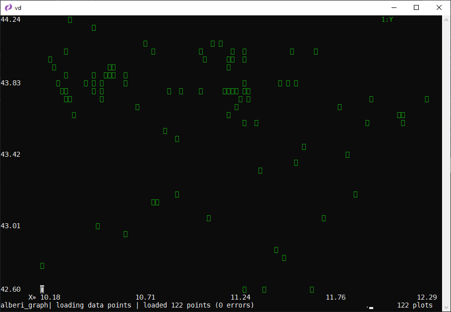

[`torna su`](#indice)

### Moduli Python

VisiData è un foglio elettronico basato su Python 3. Questo consente di utilizzare al suo interno la galassia dei moduli disponibili per Python.

Per farlo, bisogna precaricare questi moduli all'avvio di VisiData. Questo si realizza modificando il file di configurazione del programma - si chiama `.visidatarc` - contenuto nella cartella _home_ dell'utente. Se si vuole ad esempio sfruttare il modulo `datetime`, si apre in modifica il file `.visidatarc` e si aggiunge la riga

    from datetime import datetime

Poi si salva il file e si fa partire VisiData.

Se ad esempio si vuole fare un'analisi sulla data di immatricolazione per mese a partire dalla colonna `data_immatricolazione` e si volesse sfruttare il modulo `datetime`, si può procedere in questo modo:

- si va nella colonna `data_immatricolazione`;
- si preme `=`;
- si scrive nel prompt `datetime.strptime(data_immatricolazione, '%Y-%m-%d %H:%M:%S').month` e si pigia `Invio`.

Si ottiene qualcosa come quella di sotto:


E a questo punto si può rinominare la colonna premendo `^`, scrivendo "mese" e poi premendo `Invio`. E poi creare il foglio delle frequenze della colonna `mese`, pigiando `Shift+f` e scoprire che in Abruzzo si immatricola soprattutto a gennaio.


**NOTA BENE**: le funzioni del modulo `datetime` sono disponibili in modo nativo per le colonne già impostate (come tipo) a data. Quanto scritto sopra vale soprattutto come guida al come precaricare e utilizzare un modulo Python in VisiData.

[`torna su`](#indice)

### Salvare un flusso di lavoro

#### Introduzione

In **VisiData** è possibile salvare il [log delle operazione fatte](https://www.visidata.org/docs/save-restore/) e riutilizzarlo per applicarle nuovamente al file di input.

Se ad esempio a partire da [questo file `CSV`](risorse/input.csv) (sotto l'anteprima) si volessero cancellare tutte le righe che contengono il solo carattere `a` nella prima colonna e infine salvare l'*output*, la procedura è:

- `vd input.csv`;
- posizionarsi nella prima colonna e pigiare <kbd>|</kbd> per attivare la selezione tramite espressione regolare, scrivere `^a$` e premere <kbd>INVIO</kbd>. Verrà fatta la selezione descritta;
- pigiare in sequenza <kbd>g</kbd> e <kbd>d</kbd> per cancellare le righe selezionate;
- poi <kbd>CTRL+s</kbd>;
- e infine scegliere un nome di output (ad esempio `output.csv`) e pigiare <kbd>INVIO</kbd> per salvare il file.

| field1 | field2 |
| --- | --- |
| a | 0 |
| b | 3 |
| a | 4 |
| c | 5 |

Per salvare la procedura di sopra in un file di log, bisognerà premere <kbd>CTRL+d</kbd>, scegliere un nome per salvare il file (ad esempio `cancella_le_a.vd`) e pigiare <kbd>INVIO</kbd>.

Il file di log salvato avrà un contenuto come quello sottostante ([è un file `TSV`](#nota-sul-file-di-log)), in cui sono "mappate" tutte le operazioni fatte:


| sheet | col | row | longname | input | keystrokes | comment |
| --- | --- | --- | --- | --- | --- | --- |
| global |  | null_value | set-option |  |  |  |
|  |  |  | open-file | input.csv | o |  |
| input | field1 |  | select-col-regex | ^a$ | | | select rows matching regex in current column |
| input |  |  | delete-selected |  | gd | delete (cut) selected rows and move them to clipboard |
| input |  |  | save-sheet | output.csv | ^S | save current sheet to filename in format determined by extension (default .tsv) |


Per riapplicare la stessa procedura al file, senza interagire con lo schermo, il comando da lanciare è:

```
vd -b -p cancella_le_a.vd
```

- `-b` per eseguire VisiData senza attivarne l'interfaccia;
- `-p` per replicare un file di log.

Se questo comando si lancia dopo avere già creato il file di *output*, si avrà un messaggio di errore, che avvisa che il file esiste già e non può essere sovrascritto.<br>
Per fare in modo che venga sovrascritto bisognerà aggiungere l'opzione `-y`:

```
vd -y -b -p cancella_le_a.vd
```

A schermo verrà restituito l'elenco delle operazione svolte:

```
opening cancella_le_a.vd as vd
"input.csv"
opening input.csv as csv
select rows matching regex in current column
"^a$"
search wrapped
2 matches for /^a$/
selected 2 rows
delete (cut) selected rows and move them to clipboard
copied 2 rows to clipboard
deleted 2 rows
save current sheet to filename in format determined by extension (default .tsv)
"output.csv"
saving 1 sheets to output.csv as csv
replay complete
```

[`torna su`](#indice)

#### Applicare lo stesso flusso a un file diverso, ma omologo

Spesso si ha la necessità di **applicare una stessa procedura ad altri file**, con la **stessa struttura**, ma con **contenuti differenti**.<br>
Per utilizzare il file di log creato con un file diverso da `input.csv`, bisognerà modificare il file di log (si modifica con qualsiasi editor di testo):

- rimuovere la riga con il riferimento a `input.csv`
- rimuovere il riferimento al nome del foglio (qui è `input`, come il nome del file).

Diventerà quindi:


| sheet | col | row | longname | input | keystrokes | comment |
| --- | --- | --- | --- | --- | --- | --- |
| global |  | null_value | set-option |  |  |  |
|  | field1 |  | select-col-regex | ^a$ | | | select rows matching regex in current column |
|  |  |  | delete-selected |  | gd | delete (cut) selected rows and move them to clipboard |
|  |  |  | save-sheet | output.csv | ^S | save current sheet to filename in format determined by extension (default .tsv) |


Fatto questo, il comando da usare con un nuovo file denominato ad esempio `input_nuovo.csv` sarà:

```
vd -y -b -p cancella_le_a.vd input_nuovo.csv
```

In output verrà creato il file `output.csv`.

Se si vuole creare un file di output con nome diverso, si deve cancellare dal file di log la riga in cui si fa riferimento a `output.csv` e lanciare il comando:

```
vd -y -b -p cancella_le_a.vd input_nuovo.csv -o output_nuovo.csv
```

[`torna su`](#indice)

#### Nota sul file di log

Si tratta di un TSV, quindi **è possibile leggerlo e modificarlo proprio con VisiData**:


[`torna su`](#indice)

### Soluzione problemi

#### Riga attiva di colore nero

Quando si usa VisiData su Windows Subsystem for Linux, la riga attiva risulta invisibile perché tutta nera.

Per fare in modo che torni "visibile" bisogna modificare il file di configurazione di VisiData. Questo file di _default_ non esiste: si deve trovare nella home dell'utente (quindi in `~`) e si deve nominare come `.visidatarc`.

Questi i passi:

```bash
## vai nella cartella home dell'utente
cd ~
## nano è un editor di testo, si installa con "sudo apt-get install nano.
## Si può esare usare qualsiasi editor per modificare il file
nano .visidatarc
```

Si aprirà il file `.visidatarc` a cui bisognerà aggiungere le stringhe sottostanti e poi salvare il file.

```
options.color_key_col=''
options.color_selected_row='yellow'
options.color_note_type='yellow'
options.color_graph_hidden='blue'
options.color_column_sep='blue'
options.null_value=""
options.color_key_col="blue"
```

[`torna su`](#indice)

#### Caratteri non leggibili in Windows Subsystem for Linux

Se si usa VisiData in Windows Subsystem for Linux, alcuni caratteri possono risultare non leggibili. Questo dipende dal font usato.

Per cambiarlo:

1. click con il destro del mouse sulla barra;
2. e scegliere Proprietà.


Infine si consiglia il font di sotto:


### Ricette

#### Salvare una tabella HTML in CSV, a partire da una pagina web

In questo esempio il presupposto è che si voglia trasformare in CSV una tabella HTML presente in una pagina web, in cui ci sono più tabelle. Il punto di partenza è quello di estrarre dalla pagina sorgente, una pagina HTML che contiene soltanto la tabella di interesse.

La pagina di esempio è:<br><https://web.archive.org/web/20190618071304/http://www.sias.regione.sicilia.it/NHEOWLH140_00_1.html>

Questa è composta da diverse tabelle.

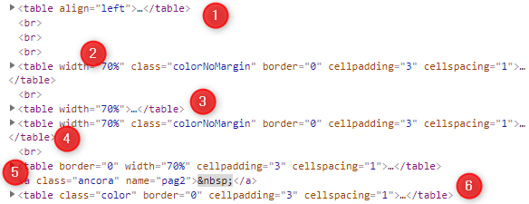

Quella di interesse è l'unica composta da più di 7 colonne, e la query XPATH per estrarla è `//table[count(tr/td)>7]`.

La pagina di origine ha l'*encoding* in `ISO-8859-1`, ed è da convertire in `UTF-8`.

Per scaricare la pagina, cambiarne l'*encoding* ed estrarre la tabella di interesse il comando può essere

```bash
curl "http://www.sias.regione.sicilia.it/NHEOWLH140_00_1.html" | \
iconv -f ISO-8859-1 -t utf-8  | \
scrape -be '//table[count(tr/td)>7]'
```

L'*utility* usata sopra per fare la *query* `XPATH` è [scrape-cli](https://github.com/aborruso/scrape-cli).<br>
In output si ha una pagina web che contiene soltanto la tabella di interesse.

Per passarla a VisiData bisognerà modificare così lo script:

```bash
curl "http://www.sias.regione.sicilia.it/NHEOWLH140_00_1.html" | \
iconv -f ISO-8859-1 -t utf-8  | \
scrape -be '//table[count(tr/td)>7]' | \
vd -f html
```

Come risultato si aprirà la finestra di sotto. Per aprire la tabella sarà necessario premere `INVIO` e poi si potrà salvare la tabella in CSV (o altri formati) digitando `CTRL+ s`.


Se si vuole inserire nello script anche la procedura di salvataggio, bisogna modificare lo script in questo modo:

```bash
curl "http://www.sias.regione.sicilia.it/NHEOWLH140_00_1.html" | \
iconv -f ISO-8859-1 -t utf-8  | \
scrape -be '//table[count(tr/td)>7]' | \
vd -b -f html -o out.csv -p dive.vd
```

Note:

- `-b` è per eseguire VisiData senza interfaccia;
- `-p dive.vd` per eseguire dei comandi (qui semplicemente l'apertura della tabella a partire dalla finestra iniziale di sopra).

Nel file [`dive.vd`](../dati/dive.vd) c'è il seguente contenuto.

```
sheet	col	row	longname	input	keystrokes	comment
			open-file	-	o
-		0	dive-row		^J
```

[`torna su`](#indice)

Il file di sopra è un file di log di VisiData (vedi [sezione dedicata](#Salvare-un-flusso-di-lavoro)). Tutte le operazioni fatte in VisiData finiscono in un log che può essere visualizzato e salvato. Quindi è possibile salvare la visualizzazione dell'elenco delle tabelle e poi l'apertura di quella di interesse.

Per creare questo di sopra:

- arrivare a visualizzare la tabella su VisiData;
- digitare `INVIO`;
- digitate `SHIFT + d` per visualizzare il log dei comandi;
- e infine `CTRL + s` per salvare il file `dive.vd`.

### Fare proposte e/o Chiedere supporto

Il luogo dove farlo è senz'altro questo [https://github.com/saulpw/visidata/issues](https://github.com/saulpw/visidata/issues). È bene farlo scrivendo sempre la versione di VisiData utilizzata, allegare i dati per replicare eventuali problemi riscontrati, documentare la procedura che si vuole realizzare.

### Note finali

Il grande **Jeremy Singer Vine** lo usa da molto più tempo di me e ha creato la migliore guida introduttiva dedicata in inglese [https://jsvine.github.io/intro-to-visidata/](https://jsvine.github.io/intro-to-visidata/), di cui sono felice di essere nei [ringraziamenti](https://jsvine.github.io/intro-to-visidata/#acknowledgments). Ne ho attinto a piene mani per scrivere questo post e colgo l'occasione per **ringraziarlo di cuore** pubblicamente.

È un'applicazione molto bella, che probabilmente per alcuni diverrà (come è adesso per me) di uso quotidiano.
<br>[Jeremy](https://jsvine.github.io/intro-to-visidata/the-big-picture/what-is-visidata/#why-not-use-visidata) afferma che per analisi complesse, analisi geospaziali, _data literature_ è meglio usare altro. Mi sembra sensato.

Non sostituisce R o Pandas, ma li può certamente affiancare e spesso precedere nel workflow di lavoro sui dati. È un altro strumento che consiglio di aggiungere nella cassetta degli attrezzi.

Lo sviluppatore principale e chi collabora con lui sono molto attenti alle richieste e alle proposte che vengono dall'esterno, in una bella mescolanza di sensibilità "tecnologica" e umana. <br>In queste settimane ho aperto diverse _issue_ a cui è stato dato sempre riscontro. Alcune erano richieste da uomo primitivo, altre erano buone: confesso di essere **orgoglioso** di avere avuto degli effetti nel rilascio dell'ultima versione (la 1.5.1) e di essere citato più volte nelle [note di rilascio](https://github.com/saulpw/visidata/releases/tag/v1.5.1). Ringrazio molto [**Saul Pwanson**](http://saul.pw/) e [**Anja Kefala**](https://github.com/anjakefala).

~~A breve gli proporrò l'integrazione in lettura e scrittura dei [`datapackage`](https://frictionlessdata.io/specs/data-package/), in modo da estendere la qualità e le modalità di lavoro su dati ben descritti e strutturati.~~ ([fatto](https://github.com/saulpw/visidata/issues/237))

Qui vorremmo **aggiornare** e **arricchire** nel tempo i testi e si accettano anche **proposte** di **integrazioni**, **correzioni** e **modifiche**.

[`torna su`](#indice)

---

### URL consigliati

- la guida di **Jeremy Singer Vine** [https://jsvine.github.io/intro-to-visidata/](https://jsvine.github.io/intro-to-visidata/)
- le ricette sul sito ufficiale [http://visidata.org/docs/](http://visidata.org/docs/);
- la documentazione ufficiale [http://visidata.org/man/](http://visidata.org/man/);
- la playlist YouTube a cura dell'autore [https://www.youtube.com/playlist?list=PLxu7QdBkC7drrAGfYzatPGVHIpv4Et46W](https://www.youtube.com/playlist?list=PLxu7QdBkC7drrAGfYzatPGVHIpv4Et46W);
- la lista visuale degli shortcut da tastiera [http://visidata.org/docs/kblayout/](http://visidata.org/docs/kblayout/).

[`torna su`](#indice)
